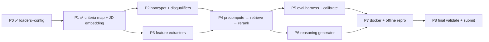

# Phased Build Plan — Redrob Candidate Ranker

**Audience:** the coding agent (and any human reviewer) executing this project end-to-end.
**Source of truth for *what* to build:** `EXCEUTION_PLAN.md` §9 (the phase table). This document is the
*detailed, executable expansion* of that table — it says **exactly what files to create, what each must
do, and the precise exit test that proves the phase is done.**

> **How to use this file**
> - Phases are **strictly ordered**. Do **not** start a phase until the previous one's exit test is green.
> - Every phase ends with a **runnable `pytest` command** and an explicit **Definition of Done (DoD)**.
> - All numbers/weights come from `config/scoring_config.yaml` — **never hard-code magic numbers in code.**
> - Keep commits **small and per-phase** (Stage-4 penalizes a single flat dump). Suggested commit message
>   prefixes are given per phase.
> - Make changes **only inside the phase's listed files** unless a fix is required in an earlier module.

---

## 0. Ground rules (apply to every phase)

| Rule | Why |
|---|---|
| **Python 3.11 only.** Build the venv with `py -3.11 -m venv .venv`. | Pinned deps (`numpy 1.26.4`, `torch 2.3.1`, `scikit-learn 1.4.2`, `sentence-transformers 3.0.1`) have **no wheels for 3.12+/3.14**; source build fails. |
| **No network / no GPU / no hosted-LLM at ranking runtime.** | Spec §3 hard constraint; violated = Stage-3 DQ. |
| **All ML/embedding work is offline (dev-time / precompute).** Runtime is pure NumPy. | Spec §3 + §10.3 (precompute may exceed 5 min; the ranking step must not). |
| **Read config, don't hard-code.** Inject `load_config()` output everywhere. | Auditable + calibratable (P5). |
| **`title` is unreliable — trust `career_history[].description`.** (See `EXCEUTION_PLAN.md` §3.1.a.) | Titles are decoupled from descriptions in the data (measured 1249/3000). |
| **Sentinels (`-1`, `{}`) = unknown, never bad → map to neutral.** | Signals doc; criteria_map §D. |
| **Determinism.** Same input → identical CSV. Fixed seeds, stable sorts, tie-break by `candidate_id` asc. | Reproducibility (Stage-3) + validator (`validate_submission.py`). |

**Repo layout the agent will end with:**

```
src/
  config_loader.py        # P0 ✅ done
  data_loader.py          # P0 ✅ done  (+100K smoke test, 20 tests)
  jd_embedding.py         # P1 ✅ done  (single + multi-query JD-intent set frozen, 24 tests)
  honeypot.py             # P2
  disqualifiers.py        # P2
  features/
    __init__.py
    role_fit.py           # P3  (semantic, dominant)
    skills.py             # P3
    experience.py         # P3
    education.py          # P3
    behavior.py           # P3  (M_behavior)
    location.py           # P3
  scoring.py              # P4  (assemble fit_score · M_behavior · P_penalty)
  precompute.py           # P4  (offline: embed all career descriptions → cache)
  retrieve.py             # P4  (shortlist top ~1–2K by s_role_fit)
  reasoning.py            # P6  (deterministic 1–2 sentence generator)
  eval/
    __init__.py
    metrics.py            # P5  (NDCG@10/@50, MAP, P@10, composite)
    proxy_labels.py       # P5  (hand-labeled tiers 0–5)
  rank.py                 # P4/P8 entrypoint: rank.py --candidates ... --out ...
  eval/test_anti_keyword.py  # P5 (tests/) — top-10 must diverge from keyword baseline
config/
  scoring_config.yaml          # P0 ✅ (now incl. role_fit:, penalties.p_scale, skills.skill_synonyms)
  jd_intent_embedding.npy      # P1 ✅ legacy single vector (back-compat)
  jd_intent_embeddings.npy     # P1 ✅ multi-query set (4 × 384) — drives s_dense
artifacts/                # precomputed cache (gitignored except a small sample)
  career_embeddings.npy   # P4 (~300K desc × 384 + offsets, offline)
  candidate_index.parquet # P4 (parsed features per candidate, incl. per-desc dates)
models/
  all-MiniLM-L6-v2/       # P7 vendored weights (offline reproduction)
tests/
  test_p0.py ✅(20)  test_p1.py ✅(24)  test_p2.py … test_p8.py  test_anti_keyword.py
Dockerfile                # P7
```

---

## P2 — Honeypot & Disqualifier Detectors (run BEFORE ranking)

**Goal:** independent integrity gates that compute a multiplicative `P_penalty ∈ (0, 1]` per candidate.
A correct reader already avoids honeypots (`EXCEUTION_PLAN.md` §4.1) — these are the **safety net**.

### Files
- `src/honeypot.py`
- `src/disqualifiers.py`
- `tests/test_p2.py`

### `src/honeypot.py` — `detect_honeypot(candidate, cfg) -> tuple[bool, list[str]]`
Implement the structural-impossibility checks (thresholds from `cfg["honeypot_detection"]`):
1. **Experience mismatch:** `abs(profile.years_of_experience*12 − Σ career_history[].duration_months) > experience_mismatch_tolerance_months`.
2. **Expert-with-zero-duration:** count skills where `proficiency ∈ {advanced, expert}` **and**
   `duration_months == 0`; flag if `> max_zero_duration_expert_skills`.
3. **Education date sanity:** any `education[].end_year < start_year` (when `education_year_sanity: true`).
4. **Tenure before existence (optional):** `career_history[].start_date` earlier than a known company
   founding year (keep a tiny hard-coded dict; this is a *bonus* check — keep simple to avoid false-kills).

Return `(is_honeypot, reasons)`. **Do not special-case the 4 sample honeypots** — keep rules general.

### `src/disqualifiers.py` — `compute_penalty(candidate, cfg, role_fit_text) -> tuple[float, list[str]]`
Multiplicative gates from `cfg["penalties"]`, combined per §2.5.d (NOT a raw product — see below):
- **honeypot** → `cfg.penalties.honeypot.score` (≈0.01) if `detect_honeypot` true. Always applied at full strength.
- **consulting_only** → **generalized (EXCEUTION_PLAN §2.5.j):** fire if the candidate's career is
  consulting-only by **either** signal — (a) **every** `career_history[].company` ∈ `consulting_companies`
  (the name list, high-precision booster), **or** (b) **every** stint has `industry == "IT Services"` AND
  `company_size` in the large-band set. **Exemption:** if **any** `career_history[]` entry has
  `industry != "IT Services"` (prior product-company tenure), the gate does **not** fire. → `consulting_only.score`.
- **research_only** → **conjunctive (EXCEUTION_PLAN §2.5.c):** fire **only if all three** hold — (1) no
  production-lexicon match using the *broad* synonym set ("shipped/deployed/launched/rolled out/served/in
  production/A‑B/inference service/online" + retrieval/ranking/recsys/search), **and** (2) no
  product-company tenure ever, **and** (3) explicit research framing ("research scientist"/"academic"/
  "lab"/"thesis"). Otherwise → mild soft demotion, **not** the ×0.20 gate. Never fire on bare keyword
  absence.
- **no_recent_code** → no ML-relevant `career_history` entry within `lookback_months` (use `start/end_date`).
  *(Note: `github_activity_score` is sentinel `-1` for many → low-coverage; lean on descriptions.)*
- **domain_mismatch** → primary skills/descriptions are CV/speech/robotics (`mismatch_domains`) with **no**
  NLP/IR evidence → `domain_mismatch.score`.
- **langchain_only_junior** → **demoted (EXCEUTION_PLAN §2.5.j):** NOT a hard gate by default. Apply the
  ×0.40 penalty **only if all three** conjunctive conditions hold — (1) total AI experience < 12 months,
  **and** (2) no pre-2022 ML production experience, **and** (3) LangChain is the candidate's **only** AI
  signal (no other ML/IR/recsys skills or description evidence). Otherwise → mild soft demotion only.
  Rationale: a real junior is already demoted by role-fit + the exp band; a hard gate risks false-firing
  on a senior who recently added LangChain.

**Penalty combination (EXCEUTION_PLAN §2.5.d, §2.5.e):** do **not** multiply all gates raw. Apply the
**worst (smallest) gate at full strength** and **soften the rest geometrically**, then apply a single
calibratable global scale to non-honeypot gates:

```
non_hp = applicable non-honeypot gate scores (each pre-scaled by cfg.penalties.p_scale)
P_penalty = (cfg.penalties.honeypot.score if honeypot else 1.0) * min(non_hp) * prod(others)**0.5
```

`p_scale` is one of the calibrated macro knobs (P5). Honeypot always applies at full ×0.01.
Return `(P_penalty, reasons)`, defaulting to `1.0` when no gate fires.

### Exit test (`tests/test_p2.py`) — DoD
- All **sample honeypots** in `data/samples` are flagged `is_honeypot == True`.
- **Zero false-kills** on the clear-fit synthetic profiles (build 3–5 obviously-good candidates → all
  return `penalty == 1.0`, `is_honeypot == False`).
- A consulting-only synthetic → penalty ≈ `0.15`; a research-only → ≈ `0.20`; **stacked →
  `min(gates) × √(other) ≈ 0.15 × √0.20 ≈ 0.067`** (the §2.5.d softened combination, NOT the raw `0.03` product).
- The `consulting_only` exemption fires when a synthetic has any prior product-co stint (industry != "IT Services").
- `langchain_only_junior` does NOT fire on a senior who recently added LangChain but has pre-2022 ML experience.
- Sentinels do not trigger any gate.
```
pytest tests/test_p2.py -v
```
**Commit prefix:** `P2: honeypot + disqualifier gates`

---

## P3 — Feature Extractors (one module per feature)

**Goal:** pure, unit-tested functions that each return a normalized score in **[0, 1]** for a single
candidate, reading only the candidate dict + `cfg`. No side effects, no I/O.

### Files
- `src/features/__init__.py`
- `src/features/role_fit.py`, `skills.py`, `experience.py`, `education.py`, `behavior.py`, `location.py`
- `tests/test_p3.py`

### `role_fit.py` — `s_role_fit(candidate, embs, jd_intents, cfg) -> float` **(DOMINANT feature)**
Implements the **blended, multi-query, recency-weighted** role signal (EXCEUTION_PLAN §2.5.a/b/f).
- **`s_dense` (multi-query, top-K mean):** `jd_intents` is a small set of frozen intent vectors
  ("production retrieval/ranking", "recsys/search at a product company", "eval frameworks NDCG/MRR/MAP",
  "embeddings + vector DB in prod"). Per candidate description, take **max cosine over the query set**;
  then pool across descriptions with **top-K mean** (`cfg.role_fit.pool="topk_mean"`, `K=2`). (Pure `max`
  is the fallback when a candidate has one description.)
- **`s_lex` (production-evidence lexical, BM25/TF-IDF):** generalized synonym lexicon
  ("shipped/deployed/launched/rolled out/served/in production/A‑B/inference service/online" + retrieval/
  ranking/recsys/search terms) matched against the descriptions. Catches engineers whose phrasing differs
  from our guessed words.
- **Blend:** `s_role_fit = cfg.role_fit.w_dense·s_dense + cfg.role_fit.w_lex·s_lex` (defaults 0.7/0.3;
  both are calibrated knobs).
- **Per-description weighting (§2.5.f — ONE combined weight, not two):** each description *d* gets a
  **single** weight `w_d = duration_norm(d) × recency_decay(d)`, where
  `duration_norm = min(duration_months / 24, 1.0)` and
  `recency_decay = 0.5 ** (months_since_end / cfg.role_fit.recency_half_life_months)`. The top-K mean is
  the `w_d`-weighted mean of the K highest per-description cosines. This pins duration and recency into
  one composition (avoids calibrating two entangled knobs — see `SYSTEM_DESIGN.md` §4.1.1). A 2024 ML stint
  outweighs a 2018 ML stint followed by marketing.
- **Thin/empty-description fallback (§2.5.h):** if concatenated description text is below
  `cfg.role_fit.min_desc_chars`, fall back to the role-affinity **title prior** (`config.role_affinity`) for
  this component — the single justified use of the otherwise-demoted title lookup. Fallback, never a bonus.
- Output: clamped to [0, 1].

> **Pre-freeze sanity check (do this in P3, §2.5.a / MINIMAX #9):** embed the few clearly-good sample
> candidates and assert the `jd_intents` set points at them (high cosine) before locking the vectors.

### `skills.py` — `s_skill(candidate, cfg) -> float`
- **Synonym collapse FIRST (§5.1 / GLM-v2 #A4):** normalize each `skills[].name` to its canonical form
  via `cfg.skills.skill_synonyms` (case-insensitive) **before** matching against `jd_core_skills`. This
  prevents double-counting — a candidate listing both "RAG" and "Retrieval-Augmented Generation" scores the
  canonical `RAG` skill **once**, not twice. Canonical names not in `jd_core_skills` are ignored.
- Match canonical `skills[].name` against `cfg.skills.jd_core_skills` (weighted). Ignore `cfg.skills.noise_skills`.
- **Endorsement curve:** linear 0 → `endorse_floor`, capped at the skill weight.
- **Duration as trust multiplier** on proficiency claims.
- Prefer **platform-verified** `skill_assessment_scores` over self-reported `proficiency`/`endorsements`.

### `experience.py` — `s_exp_band(yoe, cfg) -> float`
- Soft band peaking in `[ideal_min_yrs, ideal_max_yrs]`; taper to `acceptable_*`; near-zero below
  `hard_min_yrs`. **Not a cliff.** (JD: "range, not a requirement.")

### `education.py` — `s_education(education, cfg) -> float`
- Tier score (`cfg.education.tier_scores`, `unknown → 0.30` neutral).
- Non-linear CGPA ramp (`min_threshold`, `below_threshold_scale`, `recruiter_max`).
- Field-relevance multiplier (`relevant_fields` bonus vs penalty).

### `behavior.py` — `m_behavior(signals, cfg) -> float` **(returns multiplier ∈ [~0.5, 1.1])**
- Recency from `last_active_date` (`recency_thresholds`).
- Weighted `recruiter_response_rate`, `interview_completion_rate`; `open_to_work` bonus; notice-period adj.
- **Drop `github_activity_score` (EXCEUTION_PLAN §2.5.g):** sentinel `-1` for a large fraction → only
  discriminates a self-selected subset. Lean on the universally-populated signals above.
  (`criteria_map.md` §E already marks it ❌ dropped.)
- **Sentinels (`-1`, `{}`) → contribute nothing; fall back to `neutral_base = 0.85`.** Clamp to `[min, max]`.

### `location.py` — `s_location(profile, signals, cfg) -> float`
- **Substring** match on `cfg.location.preferred_cities` / `also_welcome_cities` (data is `"City, Region"`).
- Else `willing_to_relocate_score` / `other_india_score` / `outside_india_score`.

### Exit test (`tests/test_p3.py`) — DoD
- Each function returns a float in its declared range for the 50 sample candidates (no exceptions).
- **Monotonicity sanity:** higher CGPA → higher edu score; 7 yrs → higher exp score than 1 yr; a top-K-mean
  ML description → higher role_fit than a marketing one (reuse P1 semantic pairs).
- Sentinel inputs → behavior returns `neutral_base`, never < `min_multiplier`.
```
pytest tests/test_p3.py -v
```
**Commit prefix:** `P3: feature extractors`

---

## P4 — Offline Precompute → Hybrid Retrieve → Rerank Pipeline (`rank.py`)

**Goal:** produce a valid top-100 CSV from the 100K pool, end-to-end, within the runtime budget.
This is the spine. Split into **offline precompute** (uncapped) and **runtime ranking** (≤5 min).

### Files
- `src/precompute.py`, `src/retrieve.py`, `src/scoring.py`, `src/rank.py`
- `tests/test_p4.py`
- `.gitignore` entry for `artifacts/` (commit only a ≤100-row sample cache for the sandbox)

### `src/precompute.py` (OFFLINE — `python -m src.precompute`)
1. Stream candidates via `data_loader.iter_candidates_jsonl`.
2. For each: embed **each `career_history[].description` separately** (NOT titles) and keep them
   **per-description with `start_date`/`end_date`** so the runtime can do top-K-mean pooling AND
   recency-weighting (§2.5.b/f). Also freeze the small **multi-query JD-intent vector set** (§2.5.a).
3. Embed with `jd_embedding.embed_texts` (MiniLM, batched, `show_progress_bar`).
4. Write `artifacts/career_embeddings.npy` (per-description vectors + a candidate→rows offset index) and
   `artifacts/candidate_index.parquet` (parsed scalar features: yoe, tier, cgpa, signals, company list,
   per-description dates, description lengths for the thin-desc fallback…).
5. Record `artifacts/precompute_meta.yaml` (model, dim, count, date, pooling mode, intent-query list).

### `src/retrieve.py` — `shortlist(jd_intents, career_emb, feats, k, cfg) -> np.ndarray[idx]`
- **Two-band retrieval (MINIMAX #7):** (1) top-`k` by multi-query dense cosine (k ≈ 1–2K from `cfg`);
  (2) a small **second-chance band** of candidates with high skill/experience scores but only moderate
  cosine, so a real fit with jargon-heavy phrasing isn't dropped before rerank. Union the two bands.
- Vectorized `career_emb @ jd_intents` (max over queries). Returns candidate indices to rerank.

### `src/scoring.py` — `final_score(candidate, feats, cfg) -> tuple[float, dict]`
- `fit = w_role·s_role + w_skill·s_skill + w_exp·s_exp + w_edu·s_edu + w_loc·s_loc` (weights from cfg).
- `final = fit · m_behavior · p_penalty`.
- Return `(final, breakdown)` where `breakdown` feeds the reasoning generator (P6).

### `src/rank.py` (RUNTIME — `python rank.py --candidates ./candidates.jsonl --out ./submission.csv`)
1. **Assert no network** (monkeypatch socket or guard imports — see P7).
2. Load cached `career_embeddings.npy` + `candidate_index.parquet` + the **multi-query**
   `jd_intent_embeddings.npy` (4 × 384). **Never embed at runtime.**
3. `retrieve.shortlist` → candidate subset.
4. For each shortlisted candidate: run P3 features + P2 penalty → `scoring.final_score`.
5. Sort by `final` desc; **bottom-of-100 fallback (EXCEUTION_PLAN §2.5.i):** among near-equal weak
   candidates, order by stable secondary features (exp band) then **`candidate_id` asc**. Take top 100.
6. Write CSV: header `candidate_id,rank,score,reasoning`; ranks 1–100; **score non-increasing**; UTF-8.

### Exit test (`tests/test_p4.py`) — DoD
- Running the pipeline on the **≤100-row sample** produces a CSV that **passes `validate_submission.py`**.
- On the **full 100K** (skip if absent): produces exactly 100 rows and the **runtime ranking step
  completes in < 5 min** on CPU (assert wall-clock; this is the §7.1 latency gate).
- No honeypot from the sample appears in the produced top-N.
```
pytest tests/test_p4.py -v
python rank.py --candidates data/samples/sample_candidates.json --out outputs/sample_submission.csv
python docs/reference_docs/validate_submission.py outputs/sample_submission.csv   # adapt for <100 rows in dev
```
**Commit prefix:** `P4: precompute + retrieve + rerank pipeline`

---

## P5 — Local Proxy Evaluation Harness + Weight Calibration

**Goal:** because there is **no leaderboard** and only **3 blind submissions**, build our own scorer to
decide what to submit and to lightly tune a **few** knobs (not all of them — see `EXCEUTION_PLAN.md` §5.1).

### Files
- `src/eval/metrics.py`, `src/eval/proxy_labels.py`
- `data/labels/proxy_tiers.json` (hand-labeled relevance tiers 0–5 for ~50 sample candidates)
- `scripts/calibrate.py`
- `tests/test_p5.py`, `tests/test_anti_keyword.py`

### `metrics.py`
- Implement **NDCG@10, NDCG@50, MAP, P@10** and the exact composite
  `0.50·NDCG@10 + 0.30·NDCG@50 + 0.15·MAP + 0.05·P@10` (spec §4). Match standard definitions.

### `proxy_labels.py` + `data/labels/proxy_tiers.json`
- Hand-label ~50 sample candidates + a few synthesized honeypots into tiers **0–5** (0 = honeypot/no-fit,
  5 = ideal per JD "how to read between the lines"). Document the labeling rubric inline.
- **Independence guard (GLM #3 / MINIMAX):** the same person sets weights *and* labels, so add at least one
  of: (a) a held-out ~20 labeled by a second reviewer with inter-rater check, or (b) **synthesized
  adversarial near-miss decoys** (profiles that look like fits by the formula but should rank low) and
  assert they rank below genuine fits. This gives the proxy set independence from the weight-setter.

### `scripts/calibrate.py`
- Coordinate search over the **macro knobs** (EXCEUTION_PLAN §2.5.e, §5.1): top-level weight split,
  behavior band width, **`p_scale` global penalty scale**, retrieval `k`, and the role-fit blend
  `w_dense`/`w_lex`. **Freeze** per-skill weights & role-affinity decimals (overfit risk). Keep the knob
  count honest — `p_scale` replaces the 6 previously-hidden gate constants.
- Output the best config + the achieved composite; never silently overwrite `scoring_config.yaml`
  (write a candidate file for human review).

### `tests/test_anti_keyword.py` (EXCEUTION_PLAN §5.3)
- Compute the **pure AI-keyword-count ordering** on the sample pool (the trap baseline that
  `sample_submission.csv` embodies) and assert our top-10 **diverges** from it (low overlap /
  rank-correlation near zero). Fails loudly if the ranker ever drifts toward keyword-counting.

### Exit test (`tests/test_p5.py`) — DoD
- Metric implementations match hand-computed expected values on a tiny fixture (e.g., a known ranking).
- The composite of a deliberately-good ordering **> ** a shuffled ordering on the proxy set.
- Adversarial decoys rank below genuine fits; anti-keyword test passes.
- Calibration runs and reports a composite; tuning only the documented macro knobs.
```
pytest tests/test_p5.py tests/test_anti_keyword.py -v
python scripts/calibrate.py
```
**Commit prefix:** `P5: eval harness + calibration`

---

## P6 — Deterministic Reasoning Generator (no LLM at runtime)

**Goal:** a 1–2 **sentence** justification per candidate (spec §2 — **not** ~100 words), passing all six
Stage-4 checks.

### Files
- `src/reasoning.py`
- `tests/test_p6.py`

### `src/reasoning.py` — `generate_reasoning(candidate, breakdown, rank, cfg) -> str`
- Fill **only profile-present values** (yoe, named skills, signal values) into rotating sentence templates.
- **Build an entity whitelist** per candidate first (skill names, employers, numeric years/values, signal
  numbers); the generator may only emit content tokens from that whitelist (EXCEUTION_PLAN §6).
- **Describe the work from `career_history[].description`, not the title** (titles lie — §3.1.a).
- Tone must match rank band (top → strengths + maybe one concern; bottom → honest "adjacent only").
- Acknowledge real gaps (honest concerns check). **Never** emit a skill/employer not in the profile.
- Variation: select template by `(rank_band, dominant_feature)` so 10 sampled rows differ.

### Exit test (`tests/test_p6.py`) — DoD (encode the 6 Stage-4 checks)
1. **Specific facts:** output contains ≥1 numeric/skill value from the candidate.
2. **JD connection:** references a JD concept (retrieval/ranking/recsys/production/etc.).
3. **Honest concerns:** a candidate with a known gap → reasoning mentions it.
4. **No hallucination (whitelist, not substring — §6/MINIMAX #10):** pre-extract the allowed-entity
   whitelist per candidate; assert **every content-bearing token emitted is in the whitelist** (catches
   hallucinated years/company variants a substring check misses). Run across 50 samples.
5. **Variation:** 10 generated reasonings are not all identical / not name-templated.
6. **Rank consistency:** rank-1 tone positive, rank-100 tone cautious (lexical heuristic).
```
pytest tests/test_p6.py -v
```
**Commit prefix:** `P6: deterministic reasoning generator`

---

## P7 — Docker + Sandbox + Metadata + Git Hygiene (offline reproduction)

**Goal:** the ranking step reproduces **offline, unmodified** inside a CPU-only 16 GB container.

### Files
- `Dockerfile`, `.dockerignore`
- `models/all-MiniLM-L6-v2/` (vendored weights — see below)
- `submission_metadata.yaml` (update at repo root)
- `README.md` (single reproduce command)
- a no-network guard in `src/rank.py`

### Tasks
1. **Vendor the model weights** into `models/all-MiniLM-L6-v2/` and load `SentenceTransformer` from the
   local path during **precompute** — so a clean machine never needs the network. (Runtime doesn't load
   the model at all; it reads cached vectors.)
2. **Dockerfile:** base `python:3.11-slim`; `pip install -r requirements.txt`; copy `src/`, `config/`,
   `artifacts/`, `models/`; default CMD documents the precompute step then `rank.py`.
3. **No-network guard:** at the top of `rank.py`, block outbound sockets (e.g., override
   `socket.socket` to raise) so an accidental network call fails loudly.
4. **`submission_metadata.yaml`:** `has_network_during_ranking: false`, `uses_gpu_for_inference: false`,
   `honeypot_check_done: true` + team fields from the template.
5. **Git hygiene:** ensure commits are incremental per phase (Stage-4 penalizes flat history).

### Exit test (`tests/test_p7.py` + manual) — DoD
- `docker build` succeeds; `docker run` produces a valid sample CSV **with network disabled**.
- `rank.py` raises if any code attempts a network call (unit-test the guard).
- `submission_metadata.yaml` parses and has the three required boolean flags set correctly.
```
pytest tests/test_p7.py -v
docker build -t redrob-ranker .
docker run --rm --network none -v ${PWD}:/work redrob-ranker python rank.py --candidates /work/data/samples/sample_candidates.json --out /work/outputs/out.csv
```
**Commit prefix:** `P7: docker + offline reproduction + metadata`

---

## P8 — Final Validation + Submit

**Goal:** produce the final top-100 CSV on the full pool, validate, and prepare the submission bundle.

### Tasks
1. Run precompute (offline) → run `rank.py` on the full `candidates.jsonl` → `outputs/submission.csv`.
2. **`validate_submission.py` must pass with zero issues** (header, 100 rows, unique ranks, non-increasing
   score, tie-break by id, `CAND_` format, UTF-8).
3. **Top-10/Top-20 manual audit** (`EXCEUTION_PLAN.md` §5.2): read each top-20 career history; confirm real
   retrieval/ranking/recsys evidence; confirm no honeypot/decoy; confirm reasoning honest & rank-consistent.
4. Confirm the sandbox link runs the ≤100-row sample within budget.
5. Final commit + tag; fill the portal metadata + ≤200-word methodology summary.

### Exit test — DoD
```
python rank.py --candidates data/originals/candidates.jsonl --out outputs/submission.csv   # < 5 min ranking step
python docs/reference_docs/validate_submission.py outputs/submission.csv                    # "Submission is valid."
pytest tests/ -q                                                                            # all phases green
```
**Commit prefix:** `P8: final validated submission`

---

## Phase dependency graph



## Global Definition of Done (the whole project)
- [ ] `pytest tests/ -q` fully green on a clean Python 3.11 venv.
- [ ] `rank.py` ranking step < 5 min on 100K, CPU-only, **network disabled**, < 16 GB.
- [ ] `validate_submission.py` passes on the final CSV.
- [ ] Honeypot rate in top-100 = 0 (target) / < 10% (hard limit).
- [ ] Docker builds and reproduces the sample CSV offline.
- [ ] Reasoning passes the 6 Stage-4 checks; top-20 manually audited.
- [ ] Incremental git history; `submission_metadata.yaml` flags correct.
