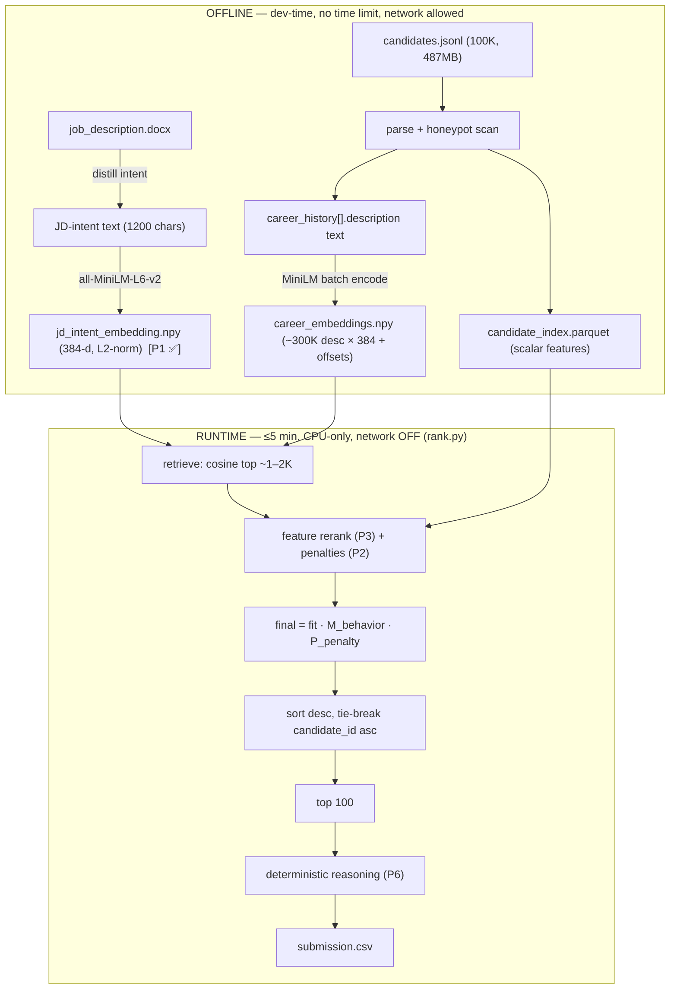

# System Design — Redrob Intelligent Candidate Ranker

**Purpose:** explain *how the system works* and *why it is built this way*, for engineers, reviewers, and
the Stage-5 defend-your-work interview. For the *what-to-build-when*, see `PHASED_BUILD_PLAN.md`; for the
decoded requirements and rationale, see `EXCEUTION_PLAN.md`.

---

## 1. Problem in one paragraph

Given a pool of **100,000 candidate JSON profiles** and a single **Senior AI Engineer** job description,
output the **top 100** candidates as a ranked CSV. The dataset is adversarial by design: it is dominated
by irrelevant roles (Business Analyst, HR Manager, Mechanical Engineer, Accountant…), it hides ~80
**honeypots** (impossible profiles), and it deliberately **decouples job titles from the work described**
to punish naive keyword matching. We are scored on a **hidden tier ground truth** with
`0.50·NDCG@10 + 0.30·NDCG@50 + 0.15·MAP + 0.05·P@10`, under hard constraints: the ranking step must finish
in **≤ 5 minutes, ≤ 16 GB RAM, CPU-only, network OFF**.

## 2. Design philosophy (the "North Star")

> **Read what a career *shows*, not what a profile *says*.**

Three principles fall out of the JD and the data, and they shape every component:

1. **Career-vs-claims gap is the dominant signal.** A "Marketing Manager" with every AI keyword is *not*
   a fit; a "Backend Engineer" whose history describes building a recommendation system *is*. So semantic
   similarity over **career descriptions** dominates the score, and **titles are distrusted** (the data
   measurably scrambles title↔description — see `EXCEUTION_PLAN.md` §3.1.a).
2. **Disqualifiers are gates, not deductions.** The JD lists hard rejects (pure-research-only,
   consulting-only, CV/speech/robotics-only, no-recent-code, langchain-only-junior). These act as
   **multiplicative kill-switches**, so a great-looking profile that trips one cannot survive on points.
3. **Availability modulates, never replaces, fit.** Behavioral signals are a **multiplier** in a narrow
   band; a perfectly-available weak fit must not outrank a strong fit.

## 3. Architecture: offline precompute, online rerank

The 5-minute / CPU-only / no-network budget forces a clean **two-stage** split. The spec explicitly allows
precomputation to exceed 5 minutes; only the **ranking step that writes the CSV** must fit.



**Why this shape:** embedding 100K profiles with a transformer at *runtime* on CPU would blow the budget,
and any hosted-LLM call is forbidden. By **precomputing all embeddings into a cache**, the runtime collapses
to **vectorized NumPy** (a matrix–vector product + scalar feature math + a sort), which is trivially within
5 minutes. The runtime **never loads the model and never touches the network.**

## 4. The scoring model

```
fit_score = w_role·s_role_fit + w_skill·s_skill + w_exp·s_exp_band + w_edu·s_education + w_loc·s_location
final     = fit_score · M_behavior · P_penalty
```

All coefficients live in `config/scoring_config.yaml` (human-readable, version-controlled — **not** the
hidden ground truth). Current priors (calibrated in P5): `role 0.45 · skill 0.25 · exp 0.15 · edu 0.10 ·
loc 0.05` (sum = 1.0).

> **REVISED (commit `e53c393`, 2026-06-26):** The calibrated values
> applied in P7 are `role 0.4765 · skill 0.2647 · exp 0.1588 · edu 0.05 ·
> loc 0.05` (sum = 1.0). The P5 calibration lowered `w_edu` from
> 0.10→0.05 and redistributed the freed 0.05 to role/skill/exp keeping
> the 9:5:3 ratio. This paragraph still shows the §2.5 priors; see
> `docs/project_explanation/WEIGHT_REVISIONS.md` for the full weight
> derivation story.

| Component | Source field(s) | How it's computed | Notes |
|---|---|---|---|
| **`s_role_fit`** (dominant) | `career_history[].description` | **Blended:** `w_dense·s_dense + w_lex·s_lex`, top-K-mean pooled, recency-weighted | `s_dense` = max cosine over a **multi-query** JD-intent set; `s_lex` = production-evidence lexical match. See §4.1. Titles ignored (except thin-desc fallback). |
| `s_skill` | `skills[]`, `skill_assessment_scores` | JD-core skills weighted (synonym-collapsed); endorsement curve capped; duration as trust; **prefer platform-verified assessment scores** | Noise skills excluded; endorsements are gameable so subordinate to descriptions. |
| `s_exp_band` | `profile.years_of_experience` | Soft band peaking 6–8 yrs | "Range, not a requirement" — taper, not a cliff. |
| `s_education` | `education[]` | Tier score + non-linear CGPA ramp + field relevance | `unknown` tier = neutral 0.30. `w_edu` is a calibrated knob (anti-credentialist JD). |
| `s_location` | `profile.location`, `willing_to_relocate` | **Substring** match (`"City, Region"`); Noida/Pune preferred, Hyderabad/Mumbai/Delhi welcome | Soft tie-breaker only (w=0.05). |
| **`M_behavior`** | `last_active_date`, `recruiter_response_rate`, `interview_completion_rate`, `open_to_work`, notice | Multiplier in **[~0.5, 1.1]**, `neutral_base 0.85` | Asymmetric: ≤+10% reward, up to −50% demotion. Sentinels → neutral. **`github_activity_score` dropped** (sentinel-heavy). |
| **`P_penalty`** | whole profile | `honeypot? × min(non_hp) × Π(others)^0.5` (gates pre-scaled by `p_scale`) | Multiplicative kill-switches; **worst gate full + softened secondaries** (not raw product). |

### 4.1 Pooling & blending for role-fit (key decision — EXECUTION_PLAN §2.5.a/b/f)
A candidate has several `career_history` descriptions, and the data scrambles them across unrelated roles.
**Averaging** would dilute a single strong ML description under marketing/ops noise; **pure max** would let
one superficial "production ML" mention vault an otherwise-unrelated profile. So we use **top-K mean**
(K≈2) over the per-description cosines — *"is there strong, repeated evidence they built retrieval/ranking/
recsys in production?"* — with two further refinements:

- **Multi-query dense (`s_dense`):** max cosine over a small **set** of frozen JD-intent vectors
  (production retrieval/ranking; recsys/search at a product company; eval frameworks NDCG/MRR/MAP;
  embeddings + vector DB in prod) — sharper than one centroid for the top band (50% of the score).
- **Lexical (`s_lex`):** a production-evidence BM25/lexical match with a *broad* synonym set, so a real
  engineer who wrote "rolled out / served / A-B tested" isn't missed by our guessed vocabulary.
- **Per-description weighting:** each description's contribution is weighted by a **single combined factor
  `weight = duration_norm × recency_decay`** (see §4.1.1), applied *before* the top-K mean.
- **Thin-desc fallback:** if a candidate has no usable description text, fall back to the role-affinity
  title prior for this component only (the single justified use of the otherwise-demoted title).

Pooling, blend weights (`w_dense`/`w_lex`), `K`, and the recency half-life all live in `cfg.role_fit`.

#### 4.1.1 How duration and recency compose (pinned, per GLM-v2 #14)
Both reweight per-description contributions, so we define a **single composition rule** to avoid
calibrating two entangled effects: for each description *d*,
`w_d = duration_norm(d) × recency_decay(d)`, where `duration_norm = min(duration_months / 24, 1.0)` and
`recency_decay = 0.5 ** (months_since_end / recency_half_life_months)`. The top-K mean is the
`w_d`-weighted mean of the K highest per-description cosines. There is exactly **one** per-description
weight, not two stacked reweightings.

### 4.2 Why multiplicative gates, not additive penalties
A keyword-stuffed honeypot could accumulate enough additive skill points to survive a subtraction. A
multiplier of ×0.01 **cannot be out-earned** — it guarantees disqualifiers stay out of the top-100,
which directly protects the honeypot-rate Stage-3 filter and NDCG@10. Gates **combine** as
`honeypot? × min(non-honeypot gates) × Π(other non-honeypot gates)^0.5` so a borderline second label
can't crush a candidate (EXECUTION_PLAN §2.5.d).

## 5. Honeypot & disqualifier strategy

**Honeypot avoidance is primarily emergent**, not bolted-on: a system that reads careers correctly
naturally scores fabricated/contradictory profiles low (their descriptions don't embed near real ML work).
The explicit detector (`src/honeypot.py`) is a **redundant safety net** catching *structural*
impossibilities a semantic reader might miss:

- experience total ≠ Σ tenure (beyond tolerance),
- advanced/expert skills with `duration_months == 0`,
- `education end_year < start_year`,
- (bonus) tenure starting before the company existed.

Disqualifier gates (`src/disqualifiers.py`) implement the JD's explicit rejects as multiplicative
penalties. We **do not special-case the sample honeypots** — rules stay general to avoid overfitting and
false-kills on the hidden pool.

## 6. Reasoning generation (no LLM at runtime)

Each top-100 row gets a **1–2 sentence** justification (spec §2), produced **deterministically** from the
candidate JSON + the score breakdown. It:
- emits **only values present in the profile** (anti-hallucination),
- **describes the work, not the title** (titles are unreliable),
- acknowledges real gaps (honest-concerns check),
- varies by `(rank_band, dominant_feature)` template rotation,
- keeps tone consistent with rank.

These map 1:1 to the six Stage-4 reasoning checks.

## 7. Evaluation without a leaderboard

There is **no public score** and only **3 blind submissions**, so we cannot probe the server. We build a
**local proxy harness** (`src/eval/`): ~50 hand-labeled candidates in relevance tiers 0–5, plus exact
implementations of NDCG@10/@50, MAP, P@10 and the composite. It is used to (a) regression-test every
change, (b) **lightly calibrate ≤4 macro knobs** (not all ~40 weights — that would overfit 50 labels and
be indefensible at interview), and (c) decide what to submit. A final **manual top-20 audit** guards the
half of the score that lives in NDCG@10.

## 8. Compute & latency budget (measured)

| Quantity | Value |
|---|---|
| Candidates | 100,000 |
| Dataset | 487 MB JSONL |
| Career descriptions | ~300K, avg ~396 chars |
| Embedding | `all-MiniLM-L6-v2`, 384-d, L2-normalized |
| Cached candidate vectors | per-description vectors (~300K × 384 × 4B ≈ **461 MB**) + candidate→rows offset index; pooled at runtime |
| Intermediate disk (spec ≤ 5 GB) | vendored model ~90 MB + vectors ~461 MB + parquet ~50–150 MB ≈ **0.6–0.7 GB** ✅ |
| **Offline** precompute | uncapped (minutes → tens of min) |
| **Runtime** ranking step | **must be < 5 min, CPU, no network, < 16 GB** |

Runtime work is dominated by a `(~300K × 384) · (384 × 4)` matmul against the multi-query intent set
(max over the 4 queries), then top-K-mean pooling per candidate and a partial sort — seconds-class on
CPU. The hard CI fail-tests are: full-100K runtime < 5 min, no-network assertion, and "never embed at
runtime" (the model is not loaded by `rank.py`).

## 9. Reproducibility & offline guarantees

- **Python 3.11 only** — pinned deps have no wheels for 3.12+/3.14 (would source-build and fail).
- **Model weights vendored** in `models/all-MiniLM-L6-v2/` so precompute runs offline; runtime needs no model.
- **Docker** (`python:3.11-slim`) builds and runs the ranking step with `--network none`.
- **Determinism:** fixed seeds, stable sort, tie-break by `candidate_id` ascending → identical CSV every run.
- **`validate_submission.py`** is run on every CSV before submission.

## 10. Data contracts (what the code relies on)

- **Input:** `candidates.jsonl`, one JSON object per line, conforming to `data/samples/candidate_schema.json`
  (`candidate_id ^CAND_[0-9]{7}$`, `profile`, `career_history[≥1]`, `education`, `skills`, `redrob_signals`).
- **Sentinels:** `github_activity_score=-1`, `offer_acceptance_rate=-1`, `skill_assessment_scores={}` mean
  *unknown* → mapped to neutral, never penalized.
- **Output:** CSV with header `candidate_id,rank,score,reasoning`; exactly 100 data rows; ranks 1–100 unique;
  `score` non-increasing; ties broken by `candidate_id` ascending; UTF-8.

## 11. Module map (where each concern lives)

| Concern | Module | Phase |
|---|---|---|
| Config load + validation | `src/config_loader.py` | P0 ✅ (20 tests) |
| Candidate I/O (streaming, 100K) | `src/data_loader.py` | P0 ✅ (20 tests) |
| JD-intent embedding (single + multi-query set) | `src/jd_embedding.py` | P1 ✅ (24 tests) |
| Honeypot detection | `src/honeypot.py` | P2 |
| Disqualifier gates | `src/disqualifiers.py` | P2 |
| Feature extractors | `src/features/*.py` | P3 |
| Offline embedding cache | `src/precompute.py` | P4 |
| Dense retrieval | `src/retrieve.py` | P4 |
| Score assembly | `src/scoring.py` | P4 |
| Runtime entrypoint | `src/rank.py` | P4/P8 |
| Eval metrics + labels | `src/eval/*.py` | P5 |
| Reasoning generator | `src/reasoning.py` | P6 |
| Containerization | `Dockerfile` | P7 |

## 12. Key risks & how the design mitigates them

| Risk | Mitigation in the design |
|---|---|
| Rewards keyword stuffing | Role-fit over descriptions dominates; skills subordinate; honeypot/keyword regression tests |
| Trusting scrambled titles | Titles distrusted; role label derived from descriptions; top-K-mean + recency-weighted blend |
| Honeypots in top-100 | Emergent avoidance + structural detector + ×0.01 gate |
| Misses 5-min budget | Offline embedding + NumPy-only runtime + measured budget + CI latency gate |
| Overfit to 50 labels | Calibrate ≤4 macro knobs; freeze the rest by principle |
| Non-reproducible at Stage-3 | Python 3.11 pin, vendored weights, Docker `--network none`, determinism |
| Reasoning hallucination | Generator emits only profile-present values; describes work not title |
